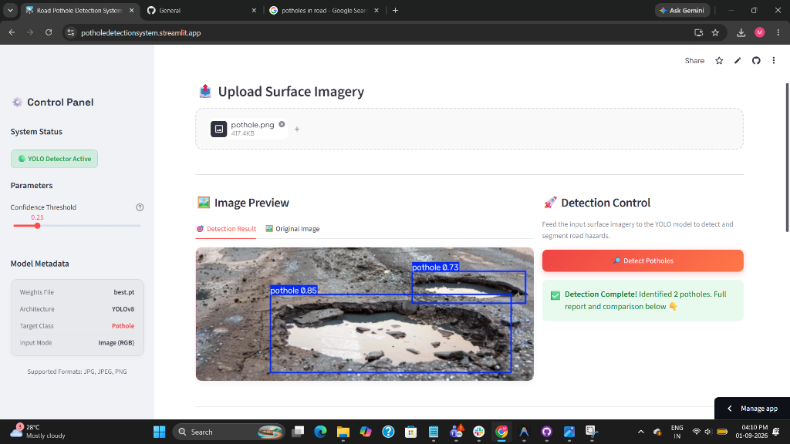
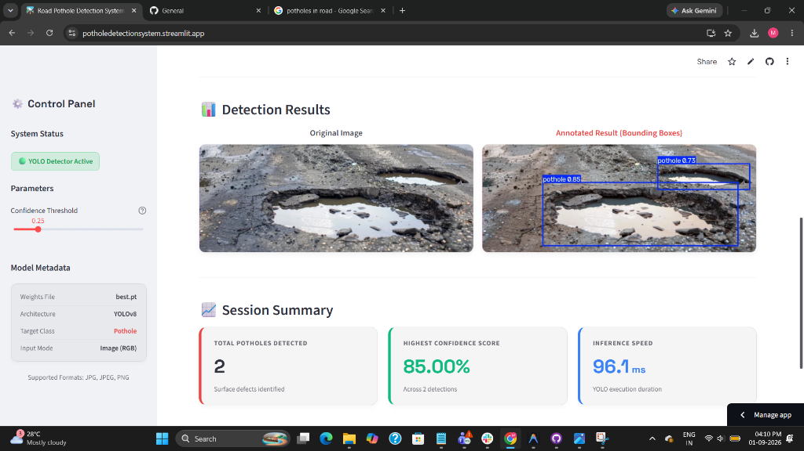
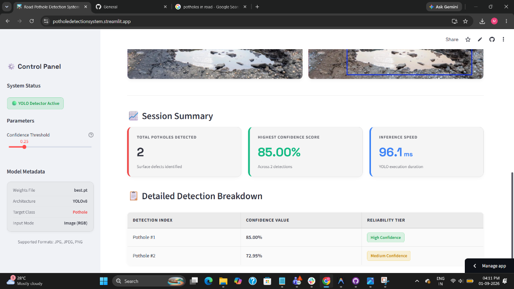
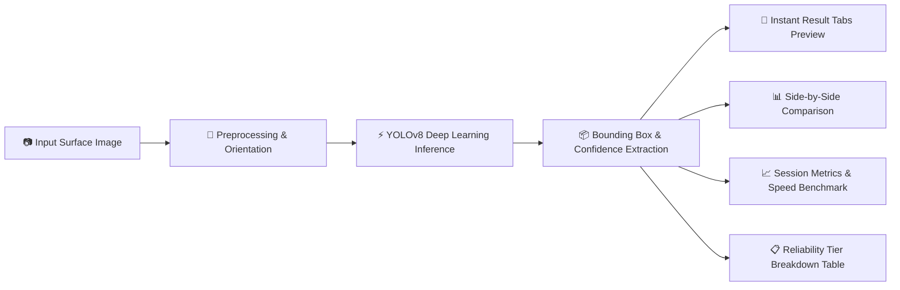

# 🛣️ Road Pothole Detection System

[](https://potholedetectorsystem.streamlit.app)


An AI-powered computer vision application designed to inspect, detect, and evaluate road surface defects and potholes in real-time. Powered by a custom-trained **Ultralytics YOLOv8** model and built with a modern, glassmorphic **Streamlit** dashboard that adapts to both Light and Dark themes.

🔗 **Live Deployment:** [potholedetectorsystem.streamlit.app](https://potholedetectorsystem.streamlit.app)

---

## 📸 Workflow & Working Explanation

The application provides an end-to-end visual inspection pipeline from image ingestion to detailed defect analytics:

### 1. Ingestion & Instant Detection Preview
Upload road surface imagery in JPG, JPEG, or PNG format. The dashboard loads the custom YOLO weights (`best.pt`) once into memory using `@st.cache_resource` and offers real-time sensitivity controls via the sidebar.

Upon clicking **🔎 Detect Potholes**, the image preview dynamically switches to reveal interactive detection tabs without requiring scrolling:

<p align="center">
  
</p>

- **Interactive Tab Toggle:** Easily flip between the **🎯 Detection Result** (annotated with localized bounding boxes and confidence tags like `pothole 0.85`, `pothole 0.73`) and the **🖼️ Original Image**.
- **Real-Time Status Confirmation:** Immediate visual feedback alerts the user to the exact number of identified hazards.
- **Sidebar Control Panel:** Fine-tune the **Confidence Threshold** slider (10% to 90%) to control detector sensitivity for different road textures and lighting conditions.

---

### 2. Side-by-Side Comparative Analysis & Session Metrics
Directly beneath the preview, the dashboard generates a full comparative breakdown comparing the raw road surface against the model's bounding-box annotations, accompanied by executive summary metric cards:

<p align="center">
  
</p>

- **Side-by-Side Image Comparison:** Clearly contrasts original road conditions against annotated defect regions.
- **Total Potholes Detected:** Quantifies total hazards identified across the surface area.
- **Highest Confidence Score:** Highlights the peak certainty score among all detections (e.g., `85.00%`).
- **Inference Speed:** Benchmarks YOLO execution latency in milliseconds (`~96 ms`), verifying production-level real-time performance.

---

### 3. Detailed Detection Breakdown & Reliability Tiers
Every detected road hazard is cataloged in a structured breakdown table that classifies defects according to confidence reliability tiers:

<p align="center">
  
</p>

- **Defect Indexing:** Each pothole candidate is assigned an individual tracking index (`Pothole #1`, `Pothole #2`, etc.) sorted in descending order of certainty.
- **Confidence Rating:** Exact percentage certainty reported by the neural network.
- **Reliability Classification:**
  - 🟢 **High Confidence (≥ 75%):** Well-defined, critical surface hazards requiring immediate road maintenance attention.
  - 🟡 **Medium Confidence (45% - 74%):** Developing surface wear, early-stage potholes, or partially obscured depressions.
  - 🔴 **Low Confidence (< 45%):** Minor road anomalies, surface shadows, or candidates near threshold limits.

---

## 🧠 System Architecture & Pipeline



---

## ✨ Core Features

- **Custom YOLOv8 Weights:** Leverages specialized weights (`best.pt`) optimized for pavement texture, cracks, and asphalt potholes.
- **Universal Glassmorphism:** Theme-aware frosted styling (`backdrop-filter`) that automatically adapts seamlessly to both **Light** and **Dark** themes.
- **Persistent State Management:** Built with `st.session_state` so detection results and metrics persist when adjusting sidebar parameters or switching views.
- **Non-Blocking Clean Logs:** Fully compatible with modern Streamlit (`width='stretch'`), eliminating deprecated parameter warnings.

---

## 📁 Repository Structure

```text
Pothole_Detection/
├── assets/
│   ├── detection_preview.png       # UI upload & real-time detection tab screenshot
│   ├── detection_results.png       # Side-by-side comparison and summary metrics
│   └── confidence_breakdown.png    # Detailed detection breakdown table
├── .gitignore                      # Git exclusion rules
├── app.py                          # Streamlit application with YOLOv8 pipeline & custom UI
├── best.pt                         # Custom-trained YOLO model weights
├── requirements.txt                # Python package dependencies
└── README.md                       # Documentation (this file)
```

---

## 🛠️ Installation & Local Setup

### 1. Clone the Repository
```bash
git clone https://github.com/Waheexd/Pothole_Detection.git
cd Pothole_Detection
```

### 2. Create and Activate a Virtual Environment

**Windows (PowerShell):**
```powershell
python -m venv .venv
Set-ExecutionPolicy -Scope Process -ExecutionPolicy Bypass
.\.venv\Scripts\Activate.ps1
```

**macOS / Linux:**
```bash
python3 -m venv .venv
source .venv/bin/activate
```

### 3. Install Dependencies
```bash
pip install -r requirements.txt
```

### 4. Run the Application
```bash
streamlit run app.py
```
*(Or directly via virtual environment executable: `.\.venv\Scripts\streamlit.exe run app.py`)*

Open your browser and navigate to **`http://localhost:8501`**.

---

## ☁️ Deployment on Streamlit Community Cloud

1. Fork or push this repository to GitHub.
2. Visit [share.streamlit.io](https://share.streamlit.io/) and click **Deploy an app**.
3. Select your repository (`Waheexd/Pothole_Detection`), set branch to `master`, and main file path to `app.py`.
4. Click **Deploy**!
